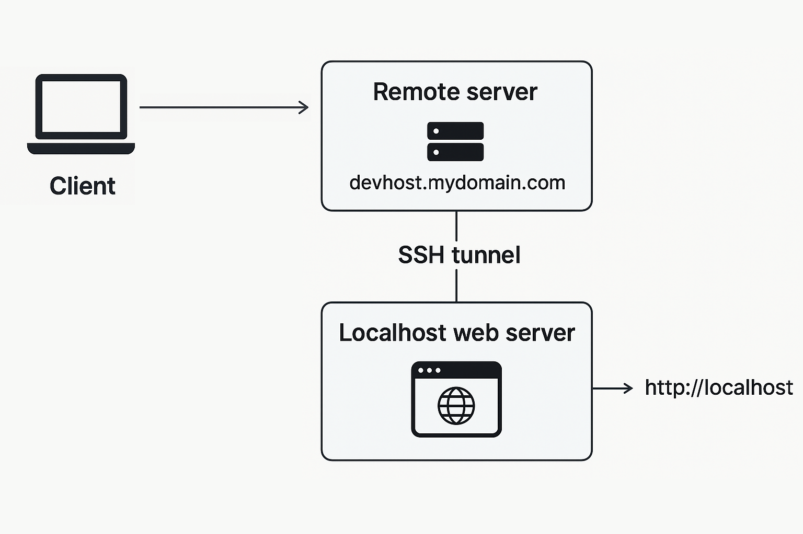

# SSH Tunnel Proxy Server

Minimal Docker setup to run a **SSH Tunnel Proxy Server with Dropbear** for reverse SSH tunneling.  
It allows your **local machine** to expose a local service (e.g., `localhost:80`) 
<p align="center" width="100%">

</p>

# 💰 Funding
If you find this project useful, consider supporting its development through cryptocurrency donations:
- BTC: `bc1qsrl63vcuqnmp6drl3f6uhcvnky2t5vqlg2r2jq` [QR code](https://dlimkin.github.io/#funding)
- ETH or (ERC-20): `0xd1ce59aD3615cdbFCc8cc2C496E9CB0E10CD543B` [QR code](https://dlimkin.github.io/#funding)
- TRON or (TRC-20): `TZ84vr4XcuKcQZAsEJUdyvq5FT6LG66NjX` [QR code](https://dlimkin.github.io/#funding)
- SOLANA: `BE3hxHZfbk7qpgPtG7hARXJrGJjpwbd1eu9geYtUZNob`  [QR code](https://dlimkin.github.io/#funding)

---

## ⚡ Features

- Lightweight Dropbear SSH server on Alpine Linux
- Configurable environment variable
- Exposes SSH and HTTP ports (configurable, default `22` for SSH, `8080` for HTTP)
- Works in Docker, Compose, and Swarm

---

## 🔗 Environment Variables

The following environment variables can be used to configured:

| Variable | Default                                                      | Description |
|----------|--------------------------------------------------------------|-------------|
| `USER_NAME` | `tunnel`                                                     | The username for SSH access. If not set, defaults to `tunnel`. |
| `SSH_PUBLIC_KEY_FILE` | *empty*                                                      | Path to the public SSH key file. If provided, the key will be copied to the user's `~/.ssh/authorized_keys`. |
| `USER_PASS` | *random* (when `SSH_PUBLIC_KEY_FILE` is *empty*) | The password for the user. If not set, a random password will be generated and printed to the console. |

### Notes:
- If `SSH_PUBLIC_KEY_FILE` is provided and valid or `authorized_keys` are mounted via volume, password authentication will be disabled.
- If no key is provided, use `USER_PASS` to set a password or a **random password** will be generated and printed to the **console**.

## 1️⃣ Docker Example

### Run container
```bash
docker run -e USER_NAME=tunnel \
  -p 2022:22 \
  -p 8080:80 \
  -v /path/to/authorized_keys:/home/tunnel/.ssh/authorized_keys:ro \
  dlimkin/ssh-tunnel-dropbear
```

### Connect from local machine
```bash
ssh -p <docker-port> -N -R 8080:127.0.0.1:80 tunnel@<docker-host>
```
### Notes:
 - `2022` is the exposed SSH port on the Docker host
 - `8080` is the exposed port on the Docker host that will forward to your local machine's port
 - `127.0.0.1:80` is the local service you want to expose (change as needed)
 - `tunnel` is the username (change if you set a different `USER_NAME`)
 - `<docker-host>` is the IP or hostname of your Docker host
 - `<docker-port>` is the SSH port you exposed (e.g., `2022`)

## 2️⃣ Docker Compose Example
### docker-compose.yml (optional Traefik labels)
```yaml
version: "3.9"

services:
  tunnel-server:
    build: .
    image: dlimkin/ssh-tunnel-dropbear
    environment:
      - USER_NAME=mycustomuser # optional, default is 'tunnel', and change in volume target below
      - USER_PASS=mysecretpass # optional, use only if no SSH key is provided
    ports:
      - "2022:22"
      - "8080:8080"
    volumes:
        - /path/to/authorized_keys:/home/mycustomuser/.ssh/authorized_keys:ro
    labels:
      - "traefik.enable=true"
      - "traefik.http.routers.tunnel-server.rule=Host(`devhost.mydomain.com`)"
      - "traefik.http.services.tunnel-server.loadbalancer.server.port=8080"
```

## 3️⃣ Docker Swarm Stack Example
### docker-stack.yml  (optional Traefik labels)
```yaml
version: "3.9"

services:
  tunnel-server:
    image: dlimkin/ssh-tunnel-dropbear
    environment:
      - USER_NAME=mycustomuser # optional, default is 'tunnel'
      - SSH_PUBLIC_KEY_FILE=/run/secrets/ssh_pub_key # optional, use docker swarm secret
    ports:
      - "2022:22"
      - "8080:8080"
    secrets:
      - ssh_pub_key
    deploy:
      replicas: 1
    labels:
      - "traefik.enable=true"
      - "traefik.http.routers.tunnel-server.rule=Host(`devhost.mydomain.com`)"
      - "traefik.http.services.tunnel-server.loadbalancer.server.port=8080"

secrets:
  ssh_pub_key:
    external: true
````
